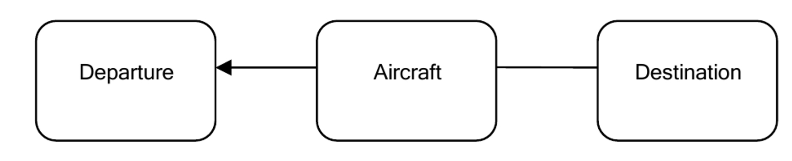
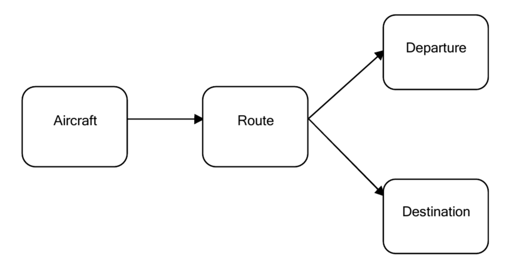
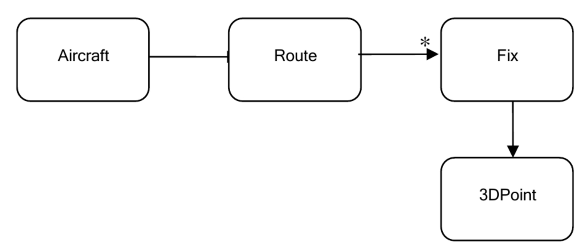
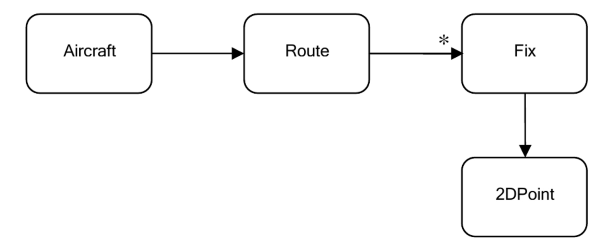

# Domain-Driven Design là gì?

Phát triển phần mềm là qui trình tự động hóa được áp dụng thường xuyên nhất trên thế giới, nó cũng là sự cung cấp giải pháp cho những bài toán nghiệp vụ thực tế; Qui trình nghiệp vụ được tự động hóa hoặc những bài toán thực tế mà ở đó phần mềm là một lĩnh vực của nghiệp vụ. Chúng ta phải hiểu từ đầu rằng phần mềm bắt nguồn và liên quan rất sâu tới domain này.

Phần mềm được làm từ mã nguồn. Chúng ta bị cám dỗ cho việc dành rất nhiều thời gian với mã nguồn và nhìn phần mềm như các đối tượng và method đơn giản.

Hãy cùng xem xét ví dụ sản xuất xe ô tô. Những người công nhân liên quan đến việc sản xuất ô tô có thể chuyên biệt hóa việc sản xuất linh kiện ô tô, nhưng khi làm vậy, họ có góc nhìn hạn chế về qui trình sản xuất cả chiếc xe ô tô. Họ coi ô tô là một tập hợp khổng lồ những linh kiện và phải ráp chúng với nhau; thực ra ô tô phức tạp hơn thế nhiều. Một chiếc xe tốt bắt đầu từ một tầm nhìn. Họ viết đặc tả thật cẩn thận. Tiếp theo là thiết kế. Rất, rất nhiều thiết kế. Sau nhiều tháng, có thể thậm chí vài năm, họ thiết kế, thay đổi, cải tiến cho tới khi thiết kế trở nên hoàn hảo, cho tới khi nó thỏa mãn tầm nhìn đặt ra ban đầu. Qui trình thiết kế có thể không luôn làm trên giấy. Nhiều phần thiết kế bao gồm việc mô hình hóa, kiểm thử dưới điều kiện cụ thể để xem xe ô tô hoạt động hay không. Sau đó, bản thiết kế thay đổi theo kết quả kiểm thử. Cuối cùng, chiếc xe được đưa vào sản xuất, họ sản xuất linh kiện và ráp chúng vào với nhau.

Việc phát triển phần mềm cũng tương tự như vậy. Chúng ta không thể ngồi yên đó và gõ code. Chúng ta có thể làm vậy nhưng nếu làm vậy chỉ hiệu quả cho những trường hợp rất đơn giản. Chúng ta không thể tạo ra phần mềm phức tạp theo cách đó.

Để tạo ta một phần mềm tốt, bạn cần hiểu về phần mềm đó. Bạn không thể làm ra hệ thống phần mềm ngân hàng nếu trừ khi bạn có hiểu biết tương đối tốt về mảng ngân hàng và những điều liên quan. Nghĩa là, để làm phần mềm tốt, bạn cần hiểu lĩnh vực ngân hàng.

Liệu có thể làm được phần mềm ngân hàng phức tạp dù không có hiểu biết nghiệp vụ tốt? Không thể. Không bao giờ. Ai hiểu về banking? Người thiết kế phần mềm? Không. Đồng chí này chỉ tới ngân hàng để gửi tiền và rút tiền khi cần. Người phân tích phần mềm? Cũng không hẳn. Anh ta chỉ biết phân tích một chủ đề cụ thể khi anh ta có đầy đủ tất cả cấu phần. Lập trình viên? Quên chuyện đó đi. Vậy là ai? Nhân viên ngân hàng, hiển nhiên. Hiểu nhất về hệ thống ngân hàng là những người ở trong đó, những chuyên gia của họ. Họ hiểu mọi thứ chi tiết, cái hay-dở, mọi vấn đề có thể và mọi quy định. Đây là nơi chúng ta thường xuất phát: Lĩnh vực (nghiệp vụ).

Khi chúng ta bắt đầu một dự án phần mềm, ta nên tập trung vào domain và hoạt động trong nó. Mục đích của cả phần mềm là để đề cao một domain cụ thể. Để làm được điều đó, phần mềm cần hài hòa với domain mà nó tạo nên. Nếu không nó sẽ gây nên sự căng thẳng với domain, dẫn tới hoạt động sai, phá hoại hay thậm chí rối loạn không kiểm soát được.

Vậy làm thế nào để làm ra phần mềm hài hòa với domain? Cách tốt nhất để làm việc đó là hãy làm cho phần mềm phản chiếu tới domain. Phần mềm cần hợp nhất với những khái niệm và thành phần cốt lõi của domain, và hiện thực hóa một cách chính xác quan hệ giữa chúng. Phần mềm phải mô hình hóa được domain.

Một số người không có kiến thức về banking có thể học bằng cách đọc thật nhiều mã nguồn về mô hình domain. Điều này là cần thiết. Phần mềm không bắt nguồn sâu từ gốc của domain sẽ phải thay đổi nhiều theo thời gian.

Rồi, chúng ta bắt đầu từ domain. Tiếp theo là gì? Một domain là cái gì đó có thật trên thế giới này. Nó không đơn thuần là nhìn vào đó và gõ ra từ bàn phím rồi trở thành mã nguồn. Chúng ta cần tạo một mô hình trừu tượng hóa cho domain.Chúng ta tìm hiểu nhiều về domain trong trao đối với chuyên gia lĩnh vực. Những kiến thức thô (về nghiệp vụ) này không dễ dàng chuyển hóa thành cấu trúc phần mềm trừ khi chúng ta xây dựng mô hình trừu tượng của nó với kế hoạch chi tiết trong đầu. Ban đầu, kế hoạch đó luôn không đầy đủ. Theo thời gian, càng làm việc với nó, chúng ta càng làm cho nó tốt hơn, trở nên rõ ràng hơn. Vậy "trừu tượng hóa" là gì? Nó là một mô hình, một mô hình của domain. Theo Eric Evans, một mô hình domain không phải là một giản đồ cụ thể; quan trọng là ý tưởng mà giản đồ đó muốn truyền đạt. Quan trọng không phải là kiến thức trong đầu của chuyên gia ngành; nó là sự trừu tượng hóa của cả nhóm, được tổ chức chặt chẽ của những kiến thức đó. Một giản đồ cần thể hiện và đối thoại với mô hình. Đây có thể là mã nguồn được viết cẩn thận hay một câu văn.

Mô hình là sự thể hiện nội bộ của chúng ta về domain cần xem xét, vốn rất cần thiết trong suốt qui trình thiết kế và phát triển. Trong suốt qui trình thiết kế, chúng ta liên tưởng tới và đề cập tới mô hình này. Thế giới chung quanh ta quá phức tạp để nhập vào đầu rồi xử lý. Ngay cả domain cụ thể cũng có thể vượt quá khả năng xử lý của bộ não con người trong một thời điểm. Chúng ta cần tổ chức thông tin, hệ thống hóa nó, chia nó thành những phần nhỏ hơn, nhóm nó thành những mô-đun theo logic, xử lý từng cái một. Đôi khi, chúng ta cần loại ra một số phần của domain. Một domain chứa quá nhiều thông tin có thể gói gọn trong 1 mô hình. Những cái thừa đó không cần xem xét tới. Đây là một thử thách nội tại của nó. Vậy, chúng ta bỏ gì và giữ gì? Đây là một phần của thiết kế, của quá trình tạo nên phần mềm. Phần mềm ngân hàng đơn thuần chỉ giữ địa chỉ khách hàng nhưng không cần quan tâm tới màu mắt của khách hàng. Một số ví dụ khác có thể phức tạp hơn ví dụ quá hiển nhiên này.

Mô hình là phần cần thiết của thiết kế phần mềm. Chúng ta cần nó để đối phó với sự phức tạp. Mọi qui trình tư duy về domain được cô đọng trong mô hình này. Chúng ta phải tự hiểu ra điều đấy. Sẽ không có ý nghĩa nếu nó chỉ được viết ở đấy, nhưng không ai hiểu, đúng không? Sử dụng mô hình này, chúng ta cần trao đổi với chuyên gia ngành, người thiết kế và kỹ sư. Một mô hình là cần thiết cho một phần mềm, nhưng chúng ta cần tạo ra cách thể hiện chúng, trao đổi với người khác. Chúng ta không cô độc trong qui trình này và do đó, chúng ta cần chia sẻ kiến thức, thông tin, những gì chúng ta biết một cách chính xác, đầy đủ, rõ ràng. Có nhiều cách khác nhau để đạt được điều này. Một là dùng hình: giản đồ, use case, hình vẽ, ảnh chụp... Một cách khác là viết. Chúng ta viết ra tầm nhìn của domain. Cách khác nữa là ngôn ngữ. chúng ta có thể và nên thế, tạo ra một ngôn ngữ để giao tiếp về những vấn đề cụ thể của domain. Chúng ta sẽ đi vào chi tiết sau nhưng ở đây cần nhấn mạnh điểm chính là; Chúng ta cần trao đổi thông qua mô hình.

Khi đã có mô hình, chúng ta bắt đầu thiết kế mã nguồn. Điều này hơi khác với thiết kế phần mềm. Thiết kế phần mềm tương tự như kiến trúc một ngôi nhà, nó là bức trang tổng thể. Còn thiết kế mã nguồn là làm việc với những gì chi tiết như địa điểm sơn tường. Thiết kế mã nguồn cũng rất quan trọng, nhưng nó không phải là phần cơ sở như thiết kế phần mềm. Lỗi thiết kế code thường dễ sửa nhưng lỗi thiết kế phần mềm thường rất tốn kém. Cũng giống như việc ta chuyển bức tranh từ phải qua trái, đặt đồ khác vào bên phải. Tuy vậy, sản phẩm cuối không thể tốt nếu không có thiết kế mã nguồn tốt. Lúc này, mẫu thiết kế mã nguồn trở nên tiện dụng và áp dụng khi cần. Kỹ thuật lập trình tốt giúp tạo mã nguồn sạch và dễ bảo trì.

Có nhiều cách tiếp cận với thiết kế phần mềm. Một là phương pháp thiết kế thác nước. Đây là phương pháp gồm nhiều bước. Chuyên gia nghiệp vụ lên yêu cầu qua việc trao đổi với chuyên gia phân tích nghiệp vụ. Người phân tích (nghiệp vụ) tạo mô hình dựa trên yêu cầu, chuyển cho lập trình viên và viết mã dựa trên những tài liệu phân tích nghiệp vụ họ nhận được. Luồng kiến thức ở đây là một chiều. Dù đây là cách tiếp cận truyền thống của thiết kế phần mềm, nó đã đạt được một mức độ thành công nhất định trong nhiều năm dù có nhiều vấn đề và hạn chế. Vấn đề chính ở mô hình này là không có phản hồi giữa chuyên gia nghiệp vụ với chuyên gia phân tích cũng như giữa chuyên gia phân tích và lập trình viên.

Một cách tiếp cận khác là phương pháp luận Agile như Extreme Programming (XP). Những phương pháp luận này là cuộc vận động tập thể chống lại cách tiếp cận thác nước vốn có nhược điểm là đưa ra thiết kế trước (khi lập trình), trước khi có thay đổi yêu cầu. Thực sự là rất khó để tạo ra mô hình phủ mọi khía cạnh của domain ngay từ ban đầu. Điều này đòi hỏi suy nghĩ và thường bạn không thể nhìn thấy hết các vấn đề liên quan ngay từ ban đầu, hay bạn không thể nhìn thấy một số hiệu ứng phụ tiêu cực hoặc lỗi trong thiết kế. Một vấn đề mà Agile muốn giải quyết được gọi là "analysis paralysis" - là tình huống thành viên nhóm sợ quyết định sửa thiết kế và do đó họ không có tiến độ. Agile khuyến khích nhận thức về tầm quan trọng của quyết định thiết kế và họ chống lại thiết-kế-trước. Thay vào đó, họ cố gắng thực thi một cách mềm dẻo qua việc phát triển lặp có sự tham gia của những người liên quan về nghiệp vụ một cách liên tục, refactor liên tục. Qua đó, nhóm phát triển học được domain của khách hàng và tạo ra phần mềm tốt hơn, phù hợp với nhu cầu của khách hàng.

Phương pháp Agile cũng có vấn đề và hạn chế riêng của nó; nó chủ trương sự đơn giản nhưng mọi người lại có cách nhìn riêng, mỗi phần có ý nghĩa riêng. Tương tự, việc refactor liên tục của lập trình viên khi không có nguyên tắc thiết kế vững chắc sẽ tạo ra mã nguồn khó hiểu và khó thay đổi. Tuy cách tiếp cận thác nước có thể dẫn tới tình trạng tập trung quá nhiều vào mặt kỹ thuật, sự sợ hãi đụng tới kỹ thuật có thể dẫn tới sự sợ hãi khác: Sợ đụng sâu, toàn diện vào thiết kế.

Cuốn sách này trình bày những nguyên tắc của thiết kế hướng lĩnh vực. Nếu được áp dụng sẽ tăng khả năng thiết kế cho mô hình và thực thi những vấn đề phức tạp trong domain theo cách dễ bảo trì. Thiết kế hướng lĩnh vực kết hợp thiết kế và phát triển, chỉ ra rằng thiết kế và phát triển có thể cộng dồn để tạo nên giải pháp tốt hơn. Thiết kế tốt tạo đà cho sự phát triển, phản hồi từ qui trình phát triển sẽ cải tiến thiết kế.

## Xây dựng Kiến thức về Domain

Chúng ta hãy xem xét ví dụ trong dự án hệ thống điều khiển lịch bay và xem kiến thức domain được xây dựng thế nào.

Có hàng ngàn máy bay di chuyển trong không gian vào một thời điểm bất kỳ. Chúng di chuyển theo quỹ đạo riêng, tới đích của chúng và quan trọng là chúng không được để máy bay đâm vào nhau. Chúng ta không thể xây dựng được cả hệ thống điều khiển giao thông, nhưng một phần nhỏ của hệ thống theo dõi bay thì có thể. Dự án được đề xuất là hệ thống theo dõi mọi chuyến bay trong một khu vực nhất định, xác định xem chuyến bay theo đúng lộ trình của nó hay không, liệu có xảy ra va chạm hay không.

Chúng ta bắt đầu phát triển phần mềm này từ đâu? Trong phần trước chúng ta nói rằng đầu tiên cần hiểu domain, trường hợp này là theo dõi không lưu. Người theo dõi không lưu là chuyên gia trong mảng này. Tuy nhiên, người theo dõi không lưu không phải là người thiết kế hay chuyên gia phần mềm. Bạn không thể hy vọng họ viết cho bạn mô tả vấn đề về domain của họ.

Người theo dõi không lưu có kiến thực rộng về domain của họ, nhưng để mô hình hóa được, bạn cần chắt lọc thông tin và tổng quát hóa nó. Khi bạn nói chuyện với họ, bạn sẽ nghe nhiều các từ như *"cất cánh"*, *"hạ cánh"*, *"máy bay trên không trung"* và rủi ro va chạm rồi việc máy bay chờ để được hạ cánh, vv... Để có một thứ tự nhịp nhàng những thông tin hỗn loạn này, chúng ta cần bắt đầu từ đâu đó.

Người điều khiển và bạn đồng ý rằng mỗi máy bay đều có điểm xuất phát và điểm hạ cánh. Như vậy chúng ta có *"máy bay"*, *"xuất phát"* và *"điểm đích"*, như hình dưới đây.

Ổn hơn chưa? Máy bay cất cánh từ một nơi vào đó và đáp xuống ở chỗ khác. Những gì xảy ra trên không trung? Lộ trình bay theo đường nào? Thực ra chúng ta cần biết hơn về những gì xảy ra trên không trung. Người điều khiển nói rằng mỗi máy bay đều được gắn với một lịch trình bay - mô tả toàn bộ lộ trình trên không. Khi nghe thấy *"lộ trình bay"*, bạn liên tưởng tới con đường mà máy bay bay trên không khi máy bay bay. Sau một hồi trao đổi, bạn biết thêm một từ thú vị: *route*. Dễ nhận thấy rằng, đập ngay vào sự chú ý của bạn, rất tốt. *"Route"* bao gồm những khái niệm quan trọng về *flight travel*. Đó là những gì máy bay làm khi nó đang bay, nó đi theo một route. Hiển nhiên là điểm khởi hành và điểm đích của máy bay là điểm đầu và điểm cuối của route đó. Do đó, thay vì gắn máy bay với điểm *"khởi hành"* và điểm *"đích"*, sẽ là tự nhiên hơn nếu ta gắn máy bay với route, ở đó route tương ứng với điểm xuất phát và điểm đích.

Tiếp tục trao đổi với người điểu khiển về route của máy bay, bạn khám phá ra rằng route được tạo từ nhiều đoạn, tạo thành một đường gấp khúc từ khởi hành tới đích. Đường gấp khúc này được giả định là đi qua một số điểm được chỉ định trước. Do đó, một route được coi là một chuỗi các *fix* liên tiếp. Vào lúc này, bạn không nhìn thấy xuất phát và đích như là điểm kết thúc của *route*, mà là hai *fix* khác nhau. Đây có thể là cách mà người điều khiển nhìn *route*, nhưng nó có ích cho việc trừu tượng hóa sau này. Kết quả dựa trên thay đổi đã khám phá như sau:

Giản đồ này thể hiện thêm một nhân tố: Mỗi *fix* là một điểm trong không gian theo một *route*, được thể hiện bằng một điểm ba chiều. Nhưng khi bạn nói chuyện với người điều khiển thì lại hiểu ra rằng anh ta không nhìn điểm theo cách đó. Thực ra anh ta nhìn route như là một ánh xạ trên mặt đất của chuyến bay. Các *fix* chỉ là các điểm trên mặt đất được xác định duy nhất qua vĩ độ và kinh độ. Như vậy, giản đồ đúng như sau:

Điều gì xảy ra ở đây? Bạn và chuyên gia nghiệp vụ nói chuyện và trao đổi kiến thức. Bạn đặt câu hỏi, anh ta trả lời. Khi họ làm việc đó tức là họ đào sâu hơn những khái niệm về mảng không lưu. Những khái niệm này xuất hiện một cách không chau chuốt, không tổ chức nhưng nó cần thiết cho việc hiểu domain. Bạn cần hiểu họ càng nhiều càng tốt từ chuyên gia về domain. Bằng cách đặt câu hỏi đúng, xử lý thông tin đúng cách, bạn và chuyên gia dần sẽ vẽ ra domain, một mô hình domain. Cái nhìn này không hoàn hảo hay không đúng, nhưng bạn cần bắt đầu từ đó. Hãy tìm cách hiểu những khái niệm cần thiết cho domain.

Giản đồ là phần quan trọng của thiết kế. Thông thường, những trao đổi giữa người kiến trúc phần mềm hay lập trình viên với chuyên gia domain thường dài. Chuyên gia phần mềm muốn trích xuất kiến thức từ chuyên gia domain và họ muốn chuyển kiến thức đó thành hình dạng có ích. Ở một thời điểm nào đó, họ có thể cần tạo prototype để xem mọi thứ hoạt động ra sao. Khi làm việc đó họ có thể tìm ra những vấn đề của mô hình hay trong cách tiếp cận của họ và nếu cần, họ thay đổi mô hình. Sự liên lạc giữa hai bên không phải là một chiều, từ chuyên gia domain tới người thiết kế phần mềm và tới lập trình viên. Có phản hồi giữa các bên và phản hồi đó giúp tạo nên một mô hình tốt hơn, trong sáng hơn và hiểu đúng hơn về domain. Chuyên gia domain hiểu lĩnh vực của họ cũng như kỹ năng ở mảng đó nhưng họ không biết cách tổ chức kiến thức của họ theo cách cụ thể, hữu ích cho người phát triển để thực thi một hệ thống phần mềm. Tư duy phân tích phần mềm của người thiết kế phần mềm đóng vai trò chính trong trao đổi với chuyên gia domain và điều đó cũng giúp cho việc xây dựng một cấu trúc cho việc trao đổi về sau như ta sẽ thấy trong chương tiếp theo. Chúng ta, những chuyên gia phần mềm (kiến trúc sư phần mềm và lập trình viên) và các chuyên gia domain cùng tạo nên mô hình cho domain và mô hình đó là nơi chuyên môn của cả hai bên giao thoa. Qui trình này có vẻ mất thời gian nhưng vì mục đích cuối cùng của phần mềm là giải quyết vấn đề nghiệp vụ trong thực tế, qui trình đó phải uyển chuyển theo domain.

\pagebreak
